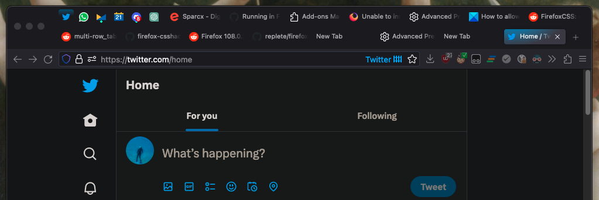

# Compact userChrome.css for Firefox

- Compact tabs
- Multi-row tabs (don't expect drag to work properly)
- Compact toolbar / urlbar
- Coloured gradient container tabs
- Hide some context menu items (Email image, Set as wallpaper...)
- alternate identity urlbar icon (for visibility)
- Tested on MacOS, Linux and Windows 2024

## How to use

1. Navigate to `about:profiles` in Firefox
	1. Open the root profile directory for your firefox profile, usually `default-release`, via `Show Directory` or `Show in Finder`
	2. Create a new `chrome` folder there
	3. Copy the contents of this repo directly into `chrome`
2. Navigate to `about:config` in Firefox
	1. Set `toolkit.legacyUserProfileCustomizations.stylesheets` to `true`
	2. Set `browser.uidensity` to `1`
3. Restart Firefox
